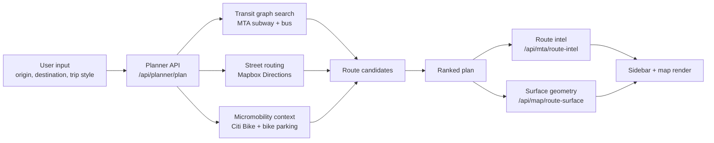

# FastTrack NYC

<p align="center">
  <strong>Beat the commute by unlocking better transit with micromobility.</strong>
</p>

<p align="center">
  New York City trip planning that treats bikes and scooters as part of the transit network, not an afterthought.
</p>

<p align="center">
  
  
  
  
  
  
</p>

---

## What It Is

**FastTrack NYC** is a multimodal trip planner for New York City that helps commuters save time by using micromobility to reach better parts of the transit network.

Instead of only asking, "What is the best subway route from here?", FastTrack asks:

> "What stronger route becomes possible if you bike or scooter for a few minutes first?"

That means:

- biking to an express stop instead of walking to a weaker local one
- skipping dead walking time
- reducing bad transfers
- comparing Transit, Mixed, and Bike/Walk routes on the same map
- surfacing practical details like bike parking, Citi Bike availability, and live transit timing

---

## Why It Matters

Most trip planners treat micromobility as a separate mode.

FastTrack treats micromobility as a **network unlock**.

A short ride can completely change the trip:

- from a slow local to a stronger express corridor
- from two awkward transfers to one clean ride
- from "not worth it" to "actually faster"

FastTrack does not just show a route. It shows **why** the route is faster.

---

## Core Experience

### Trip styles

FastTrack currently supports four commuter-friendly trip styles:

| Mode | What it does |
| --- | --- |
| `Fastest` | Picks the best overall option across the supported route set |
| `Mixed` | Assumes you have your own bike or scooter and combines it with transit |
| `Transit` | Focuses on MTA-only travel |
| `Bike/Walk` | Compares walking, personal ride, and direct Citi Bike options |

### What the app shows

- a persistent map with active and alternate routes
- route timelines with walking, transit, bus, and micromobility segments
- MTA route intel with scheduled fallback and realtime support when an API key is configured
- Citi Bike pickup and return context
- nearby bike parking for personal micromobility routes
- autocomplete for neighborhoods, businesses, and partial addresses
- NYC-focused demo scenarios for strong showcase trips

---

## Live Integrations

FastTrack is grounded in real city data:

- **MTA GTFS static** for subway and bus network structure
- **MTA GTFS-Realtime** for live departures and alerts when `MTA_API_KEY` is configured
- **Mapbox Directions API** for road-following walk and ride geometry
- **Mapbox Search** for flexible NYC place search and autocomplete
- **Citi Bike GBFS feeds** for live station, bike, and dock availability
- **NYC bike parking data** for personal bike parking suggestions

When realtime data is unavailable, the app degrades to scheduled service instead of failing hard.

---

## Visual/Product Highlights

- Google-Maps-style split layout with the map always visible
- compact route comparison rail instead of dashboard clutter
- alternate routes rendered directly on the map
- street-following access legs instead of straight-line guesses
- transit geometry rendered from MTA GTFS when available
- smooth loading states that avoid misleading stale routes

---

## Architecture



---

## Tech Stack

- **Framework:** Next.js 16 App Router
- **UI:** React 19, Tailwind CSS 4, Radix primitives, Motion
- **Mapping:** Mapbox GL JS
- **Data processing:** GTFS static parsing, GTFS-Realtime protobuf decoding
- **Language:** TypeScript
- **Deployment target:** Vercel

---

## Local Development

### 1. Install dependencies

```bash
npm install
```

### 2. Configure environment variables

Create `.env.local` in the project root:

```env
NEXT_PUBLIC_MAPBOX_ACCESS_TOKEN=your_mapbox_token
MTA_API_KEY=your_mta_api_key
```

Notes:

- `NEXT_PUBLIC_MAPBOX_ACCESS_TOKEN` is required for map rendering, place search, and street routing.
- `MTA_API_KEY` is optional but strongly recommended if you want realtime MTA departures and alerts.
- The app also accepts `MTA_API_ACCESS_KEY` or `MTA_API_TOKEN`, but `MTA_API_KEY` is the preferred name.

### 3. Start the app

```bash
npm run dev
```

Open [http://localhost:3000](http://localhost:3000).

### 4. Validate before shipping

```bash
npm run lint
npm run build
```

---

## Deployment on Vercel

### Safe deployment flow

1. Run `npm run lint`
2. Run `npm run build`
3. Add environment variables in Vercel:
   - `NEXT_PUBLIC_MAPBOX_ACCESS_TOKEN`
   - `MTA_API_KEY`
4. Create a preview deployment first
5. Verify the map, route switching, transit geometry, and micromobility context
6. Promote to production only after preview looks clean

### CLI flow

```bash
vercel login
vercel link
vercel
vercel --prod
```

---

## Project Structure

```text
app/
  api/
    map/route-surface/        Mapbox-backed route geometry
    micromobility/context/    Citi Bike + parking context
    mta/route-intel/          Transit departures, alerts, geometry
    planner/plan/             Main multimodal planner
    search/autocomplete/      Place search

components/
  fasttrack-app.tsx           Main application shell
  map-stage.tsx               Map rendering and route overlays
  location-autocomplete-field.tsx

lib/
  planner/                    Route engine
  mta/                        GTFS static + realtime logic
  mapbox/                     Search and directions integration
  micromobility/              Citi Bike integration
  parking/                    Bike parking context
```

---

## Current Behavior and Tradeoffs

FastTrack is built to be demo-strong and NYC-specific.

That means:

- it is optimized for believable, high-value mixed-mode routing in NYC
- it uses real data where possible and graceful fallbacks where necessary
- it is honest about uncertainty instead of inventing realtime it does not have

Known tradeoffs:

- some subway lines have incomplete GTFS shape coverage, so the app falls back to station-sequence geometry where needed
- MTA realtime depends on an API key and feed availability
- Citi Bike cost is currently modeled as **single-ride classic bike pricing**
- the product is NYC-first and not yet generalized to other cities

---

## Data Sources

- [MTA Developer Resources](https://api.mta.info/)
- [Mapbox Directions API](https://docs.mapbox.com/api/navigation/directions/)
- [Mapbox Search](https://docs.mapbox.com/api/search/)
- [Citi Bike System Data](https://citibikenyc.com/system-data)
- [NYC Bike Parking](https://nycdot.maps.arcgis.com/apps/webappviewer/index.html?id=874b3b510e724a4f8f646283e5a623a8)
